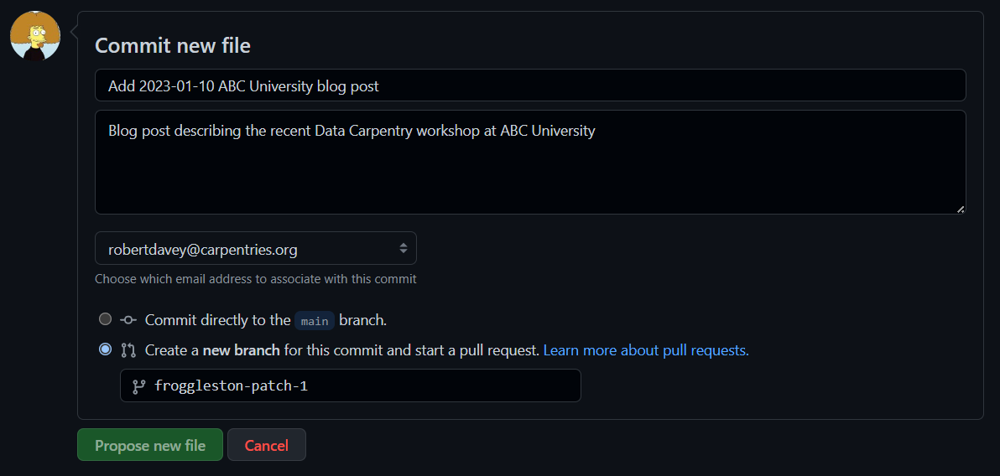

## Collaborative Blog Post Writing

The Carpentries welcomes blog posts from our community members including workshop host sites,
instructors, learners, and more. Are you interested in publishing a post on The Carpentries blog?


### Table of Contents

1.  [Sharing blog post ideas](#sharing-blog-post-ideas)
2.  [How to contribute a blog post](#how-to-contribute-a-blog-post)
3.  [Requirements](#requirements)
4.  [Preparing the GitHub Repository](#preparing-the-github-repository)
5.  [How to create a Markdown file](#how-to-create-a-markdown-file)
6.  [How to submit your GitHub Markdown file](#how-to-submit-your-github-markdown-file)
7.  [How to submit your local Markdown file](#how-to-submit-your-local-markdown-file)
8.  [Post-submission checks](#post-submission-checks)
9.  [Uploading an image](#uploading-an-image)
10. [Troubleshooting](#troubleshooting)


### Sharing blog post ideas

- Join The Carpentries Slack and share your blog post idea in the #blog-post-ideas channel to start
discussion and invite other community members to collaborate with you (<mark>preferred</mark>)

- Email community[at]carpentries[dot]org with your idea and one of the team will facilitate 
amplification of the idea in the community so others can reach out and collaborate with you
(<mark>option</mark>)


### How to contribute a blog post

Our blog content is formatted in Markdown, and rendered as HTML automatically. You can submit 
your blog post draft in one of three ways.

__In all cases__, please read the [Requirements](#requirements).

#### Preferred Mechanisms

These methods are the preferred route for non-experts in Git and GitHub:

- Create and edit a Markdown file directly in The Carpentries blog GitHub repository, then raise 
  a Pull Request. Follow [these instructions](#creating-a-markdown-file-in-github).

__OR__

- Email your blog post draft to community[at]carpentries[dot]org, or submit it through 
  [this form](https://docs.google.com/forms/d/e/1FAIpQLSeiu5NzJsLxYueaQrNn_qKbaa5JR2Sz12CeCRyedKQxwb54Dw/viewform)
  and one of the team will follow up with you to get it published.

#### For users confident in GitHub and Markdown

This method is suited to those more confident in GitHub and who prefer to edit Markdown locally:

- Create a local text file with a `.md` extension, edit it as Markdown 
  [[see Markdown cheatsheet](https://www.markdownguide.org/cheat-sheet/)], and upload to GitHub. 
  Follow [these instructions](#creating-a-markdown-file-locally).

<!-- 4. Create a [CodiMD](https://codimd.carpentries.org/) file, convert your post to Markdown 
[[see Markdown cheatsheet](https://www.markdownguide.org/cheat-sheet/)], and upload to GitHub. 
Follow [these instructions](#creating-a-markdown-file-with-codimd). -->


### Requirements

Whether you create your markdown file [locally](#creating-a-markdown-file-locally) or online 
via the [GitHub editor](#creating-a-markdown-file-in-github), please use the following naming
conventions. All blog posts are required to follow certain standards for naming and formatting:

- Name your Markdown file according to the lower kebab case convention (hyphens separate words).
- Make sure your file extention is `.md` so that GitHub will recognise your file as Markdown.
- Prefix the blog post filename with the date of publication, following the ISO standard.

`YYYY-MM-DD-filename.md`

e.g.

`2018-04-29-book-review-teaching.md`

#### Recommendations

* Try to avoid using shorthand, acronyms, or contractions in Markdown file names 
* Favor using the actual numbers in the file names: use
  `12` rather than `twelve`.
* When relevant, include `carpentries` in the file names: favor
  `new-carpentries-team-member` over `new-team-member`.
* Use 3 to 6 words to compose the file names and the headings
  on your page and blog posts.
* For titles:
  * Please use title case 
  * We recommend making sure the title is descriptive and uses no more than 5-7 words. 
  * When possible, use an action verb or call to action e.g. :"Amending the Carpentries Bylaws 
    in 2020" or "Expanding The Carpentries Community in California"
* For headers/previews: 
  * We recommend a full sentence that succinctly describes the contents of the blog, e.g. "Read 
    on to learn about our strategic plan progress through Q3 2020 (July - September)" or "Join 
    us in welcoming our new Maintainer Community Lead!"
  * Please avoid using "In this blog post..."
  * If your title does not have a direct call to action, please include one in the header/preview 
    text


### Preparing the GitHub Repository

Your blog post needs to be held in a specific date folder within the GitHub repository. To check 
this: 

1.  Go to <https://github.com/carpentries/carpentries.org>.

2.  Click on the `_posts` folder, and go to the year in which you wish to add your 
    post, e.g. `2023`.

3.  There should be folders based on the month of that year, e.g. `02` for February,
    `10` for October, etc.

4.  If a folder already exists for the month in which you want your post to be published, 
    you can skip the next step and continue with
    [creating your Markdown file](#how-to-create-a-markdown-file).

5.  If a folder does not exist for the month you need:

    - Click on the year, e.g. `2023`, click `Add file` then `Create new file`, and in the box 
      that says `Name your file...`, enter in the month followed by a slash and `.empty`, e.g.
      `02/.empty`. This will create an empty file in the new directory - this is needed because
      Git and GitHub cannot track empty folders. You don't need to use the `.empty` file for
      any task, so you can ignore it from now on.
       
    - At the bottom of the page, select `Create a new branch for this commit and start a pull 
      request`. make a note of the name of the patch, and click `Propose new file`.
    
      
    
    - On the next window, click `Create pull request`.
    
    - A new PR should now open, with a line that reads `<you> wants to merge 1 commit 
      into main from <new_patch_branch_name>`. The `<new_patch_branch_name>` will match the name 
      given to you when you created your PR.
       
    - Click on the `<new_patch_branch_name>` link, e.g. `froggleston-patch-1`, and navigate back 
      to the `_posts/<year>/<month>/` folder.
       
    - Make sure `Commit directly to the <new_patch_branch_name> branch` is selected.
    
    - Click `Commit changes`.
    
    - You can now continue with [creating your Markdown file](#how-to-create-a-markdown-file). 


### How to create a Markdown file

Markdown files are text files, so need no special software to create and edit. You can use any 
text editor or GitHub's online editor to work on your Markdown files. 

#### Creating a Markdown file in GitHub

Note that the online editor in GitHub __does not__ auto-save! You have to commit your changes
to save your markdown file.

1.  Make sure you are in the correct `_posts/<year>/<month>/` folder in the GitHub repository

2.  Click `Add File` and select `Create new file...` in the dropdown

3.  Provide the name of your file in the `Name your file...` box, using the naming convention
    set out in the [Requirements](#requirements)

4.  In the main editor window:

    - Make sure you have entered the required information at the top of your file, as set out in
      the [YAML header instructions](#specifying-the-required-yaml-header)
    - Continue to write your blog post in the online editor, using the Preview tab if needed
    - If you have any images to add, follow the [Uploading Images](#uploading-an-image) section

5.  Submit a Pull Request to The Carpentries blog GitHub repository by
    following [these instructions](#how-to-submit-your-github-markdown-file)

#### Creating a Markdown file locally

Using a text editor or your local operating system functions, create a local 
[Markdown](https://guides.github.com/features/mastering-markdown/) file for your 
blog post, naming it according to the [requirements](#requirements) above:

- Make sure you have entered the required information at the top of your file, as set out in
  the [YAML header instructions](#specifying-the-required-yaml-header)

Then:

- Open an issue in The Carpentries blog GitHub repository with new post appended to the issue 
  title, and one of the team will help get it published.

__OR__

- Submit a Pull Request to The Carpentries blog GitHub repository by
  following [these instructions](#how-to-submit-your-local-markdown-file)

<!-- #### Creating a Markdown file with CodiMD -->

<!-- todo -->

#### Specifying the Required YAML Header

1.  All blog posts need to contain a specific header so that they can be processed correctly into 
    HTML for rendering in a web browser.

2.  This header is in the YAML format, and needs to be at the top of your Markdown file. Copy and 
    paste the example below, or use an example from an 
    [existing blog post](https://github.com/carpentries/carpentries.org/blob/gh-pages/_posts/2018/04/2018-04-25-website-launch.md),
    e.g.

    ```
    ---
    layout: page
    authors: ["Tracy Teal", "Belinda Weaver"]
    teaser: "New website for access to all things Carpentries"
    title: "Launching The Carpentries Website"
    date: 2018-04-25
    time: "09:00:00"
    tags: ["Website", "Communications"]
    ---
    ```

    Separate the header block from the post text by inserting a new line.
    
3.  All fields should be filled in. If there is more than one author, separate the author names 
    like this: `["Name 1", "Name 2"]`.

4.  You can include a `time:` entry in the YAML header of the blog posts. The time is in the 
    24-hour format and in UTC. It is useful to think of this time as the earliest the post will 
    appear on the website, but it could end up being published a few hours later. Our website is 
    being built every 6 hours at 00:30, 06:30, 12:30, 18:30 UTC. So if you include 
    `time: 08:00:00` in the YAML header of your post, your post will appear after the 12:30 build 
    completes. However, if there is a manual update to the website at 9:00, your post will appear 
    soon after completion of the build triggered by this change.

5.  If you want to add images to your blog post, please follow the [Adding Images](#adding-images) 
    instructions.


### How to submit your GitHub Markdown file

1.  Once you have finished editing your markdown file (you can always make more changes later!),
    scroll to the bottom of the editor page.

2.  In the `Commit new file` section, add a short title in the first text box. Titles are 
    usually in the present tense e.g. 

    `Add Jan 2023 ABC University workshop blog post`

3.  Add a description in the second text field if desired - this is not mandatory, but good 
    practice

4.  Click `Create a new branch for this commit and start a pull request` at the bottom of the 
    page, make a note of the name of the patch, and click `Propose new file`.

    

    On the next page, click `Create pull request`.

5.  A new PR will now be open, with a line that reads `<you> wants to merge 1 commit 
    into main from <new_patch_branch_name>`. The `<new_patch_branch_name>` will match the name 
    given to you when you created your PR.

6.  If you wish to add any images, follow [Uploading an Image](#uploading-an-image) below,
    remembering to use the new branch name of your open PR when committing your images.

6.  Congratulations, you're done!


### How to submit your local Markdown file

1.  Make sure you are in the correct `_posts/<year>/<month>/` folder in the GitHub repository
    
2.  Click `Upload files`, drag your new blog post markdown file into the box, or click `choose 
    your files` to open a file browser, select your file, and click OK.

3.  Click `Create a new branch for this commit and start a pull request` at the bottom of the 
    page, make a note of the name of the patch, and click `Propose changes`.
       
    
       
    On the next page, click `Create pull request`.
    
4.  A new PR will now be open, with a line that reads `<you> wants to merge 1 commit 
    into main from <new_patch_branch_name>`. The `<new_patch_branch_name>` will match the name 
    given to you when you created your PR.
       
5.  Click on the `<new_patch_branch_name>` link, e.g. `froggleston-patch-1`, and navigate back 
    to the `_posts/<year>/<month>/` folder.
    
6.  Once you have previewed your file, commit it making sure `Commit directly to the 
    <new_patch_branch_name> branch.` is selected, and by clicking `Commit changes`

7.  Congratulations, you're done!


### Post-submission checks

We automatically run tests using [Netlify](https://www.netlify.com) on your Pull Requests. Please 
review your pull request a few minutes after you have submitted it to make sure those tests have 
passed. These tests look for valid YAML headers and make sure that the post will build properly. 
Once tests have passed, Carpentries Core Team will review and merge your Pull Request or reach 
out to you with more questions.


### Uploading an image

1.  If you want to include images that are already hosted on the web, go to step 4.

2.  To upload any images from your local PC, first make sure you are on the 
    `<new_patch_branch_name>` branch by clicking the drop down in the top left of the main code
    tab.
    
    **Do NOT use `main` as the branch to upload images**. Use the PR branch name created in the 
    [local](#how-to-submit-your-local-markdown-file) or 
    [online](#how-to-submit-your-github-markdown-file) steps above.

    - Go to the `images/blog/` folder.
    
    - If the year and month does not exist as in [section above](#preparing-the-github-repository),
      click `Add file`, `Create new file`. In the next window type the 
      `<year>/<month>/` in the `Name your file...` box. Scroll to the bottom of the page and make 
      sure `Commit directly to the <new_patch_branch_name>.` is selected. Then `Commit new file`.
       
    - If the folder does exist, click on the correct year and month folder into which you want to 
      upload your images, e.g. `carpentries.org/images/blog/2023/01/`.

3.  Click `Upload files`, drag or select the image files you wish to upload, make sure `Commit 
    directly to the <new_patch_branch_name>.` is selected, and click `Commit changes`.
     
4.  You can now edit your blog post markdown to link to the images you just uploaded.

    - Go back to the `_posts/<year>/<month>/` folder and select the blog post markdown file you 
      uploaded or edited online. Click the `Edit this file` button on the right, denoted by the 
      pencil icon to the right of the Raw and Blame buttons.
      
    - Images should be linked using Markdown, and paths to the image should be relative.
    
    - Make sure the naming of your images is descriptive of what they are showing.
      For example, an image of a Carpentries workshop at ABC University and the date in YYYY-MM-DD 
      format, `2023-01-10-carpentries-workshop-abc.jpg`.
       
    - Change the placeholders you added into your text into the following, using the formatting 
      shown:

      `[<alt_text>]({{ site.urlimg }}/blog/<image_folder>/<image_name>)_<caption>_`
     
    - Example:   
        
       `_A Carpentries workshop at ABC University_`
    
    - In the example, The following changes were made:
        - `<alt_text>` was replaced with `Carpentries workshop at ABC University`
        - `/blog/<image_folder>/<image_name>` was replaced with the location and title of your 
          image, `blog/2023/01/2023-01-10-carpentries-workshop-abc.jpg`
        - `<caption>` was replaced with a caption, `A Carpentries workshop at ABC University`

    - A web link should be used for images hosted elsewhere. Please be sure you have rights to use 
      this image before including it. Example:

      `_<caption>_`
  
    - If you are not sure how to add images in Markdown format, look at an
      [existing post with a locally hosted image](https://github.com/datacarpentry/datacarpentry.github.io/blob/master/_posts/2017-12-19-frb_carpentry.md)
      and copy the formatting from there.

5.  Once you have completed your changes, you can click on the `Preview` tab to make sure your 
    images are showing.

6.  To commit, follow the [local](#how-to-submit-your-local-markdown-file) or 
    [online](#how-to-submit-your-github-markdown-file) submission step.


### Troubleshooting

The most likely reason posts fail to build is because of unsupported characters in the YAML header.
Unsupported characters generally occur because material has been pasted in directly from programs 
like Word or Google documents. The most common unsupported characters that cause issues are smart 
quotes (curly quote marks as opposed to plain ones), but others might be em or en dashes, 
mathematical or other symbols, or other characters that cannot be rendered in plain text by typing 
on a keyboard. Replace smart quotes with plain quote marks and smart em or en dashes with plain 
hyphens to avert any problems.
